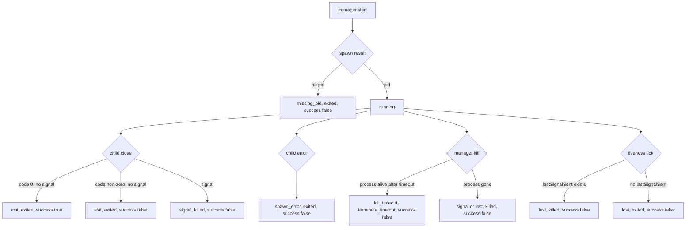
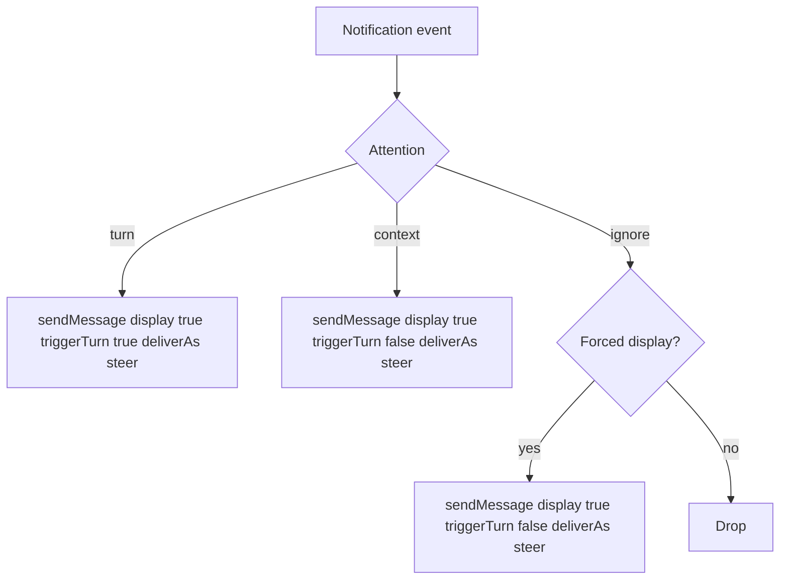

# Process notifications and end-cause plan

## Purpose

This document is the implementation plan for process end-cause metadata and process notifications in `@aliou/pi-processes`. It is intentionally scoped to this part of the rewrite and does not replace `PLAN.md`.

The plan assumes the current rewrite architecture:

- `src/` is a Pi-agnostic process manager library.
- `extensions/processes/` is the Pi-aware core extension.
- The manager emits neutral lifecycle/output events.
- The extension owns notification policy, custom messages, agent turns, TUI rendering, and log matching.

## Current state

The manager currently exposes neutral process state:

```ts
export type ProcessStatus =
  | "running"
  | "terminating"
  | "terminate_timeout"
  | "exited"
  | "killed";

export interface ProcessInfo {
  id: string;
  name: string;
  pid: number;
  command: string;
  cwd: string;
  startTime: number;
  endTime: number | null;
  status: ProcessStatus;
  exitCode: number | null;
  success: boolean | null;
  stdoutFile: string;
  stderrFile: string;
}

export type ManagerEvent =
  | { type: "process_started"; info: ProcessInfo }
  | { type: "process_ended"; info: ProcessInfo }
  | {
      type: "process_output_changed";
      id: string;
      appendedText?: Array<{ type: "stdout" | "stderr"; text: string }>;
    }
  | { type: "processes_changed" };
```

The manager no longer has `alertOn*`, `logWatches`, `addLogWatches()`, or `process_watch_matched`. That is the right boundary. Do not add those concepts back to `src/`.

## Design goals

1. Keep the manager neutral and Pi-agnostic.
2. Add enough process-domain facts to classify failures accurately.
3. Use Pi custom messages for notifications so events are persisted in sessions, visible in exports, and available after resume.
4. Do not use the Pi `context` event for process updates.
5. Support three agent attention modes:
   - `turn`: add a custom message and trigger an agent turn.
   - `context`: add a custom message that the agent can see later, without triggering a turn.
   - `ignore`: do not notify the agent.
6. For now, always display process notification messages in the TUI.
7. Wrap notification content in a clear machine-readable envelope so the agent can distinguish process events from user messages.
8. Support custom TUI rendering for notification messages.
9. Keep display/user-preference work simple for now. Future settings may hide some notification categories, but initial behavior is always display.

## Pi API findings

Pi supports exactly the custom-message behavior we need.

### `pi.sendMessage(message, options?)`

`pi.sendMessage()` injects a custom message into the session.

```ts
pi.sendMessage(
  {
    customType: "my-extension",
    content: "Message text",
    display: true,
    details: { /* extension metadata, not sent to the LLM */ },
  },
  {
    triggerTurn: true,
    deliverAs: "steer",
  },
);
```

Delivery modes:

- `"steer"` default: queues while streaming and is delivered after the current assistant turn finishes executing tool calls, before the next LLM call.
- `"followUp"`: waits for the agent to finish. Delivered only when the agent has no more tool calls.
- `"nextTurn"`: queued for the next user prompt. Does not interrupt or trigger anything.

`triggerTurn: true` only applies to `"steer"` and `"followUp"`. It is ignored for `"nextTurn"`.

### Custom messages participate in LLM context

Pi session format documents `CustomMessageEntry` as extension-injected messages that do participate in LLM context.

Important fields:

- `customType`: extension message type.
- `content`: string or normal message content array. This is sent to the LLM.
- `display`: when `true`, the message is shown in the TUI; when `false`, it is hidden.
- `details`: extension metadata. This is not sent to the LLM.

For this project:

- Use `display: true` for all process notifications initially.
- Use `display: true`, `triggerTurn: false`, `deliverAs: "steer"` for context-only notifications. This persists the event, shows it in TUI, and makes it available to the agent later without triggering a turn.
- Use `display: true`, `triggerTurn: true`, `deliverAs: "steer"` for turn notifications.

### Custom TUI rendering

Pi supports custom message renderers:

```ts
pi.registerMessageRenderer(MESSAGE_TYPE_PROCESS_NOTIFICATION, renderer);
```

Use this to make process notifications visually distinct from user messages. The renderer uses `message.details` for rich TUI display. The LLM sees `content`, not `details`.

### Avoid the `context` event

Pi has a `context` event that can modify messages before each LLM call. Do not use it for process notifications. Custom messages are better here because they are session entries, survive resume/export, and do not require invisible context mutation.

## Manager update: end-cause metadata

### Why this is needed

Current `ProcessInfo` cannot distinguish these cases cleanly:

- normal success
- normal non-zero exit
- child process closed because of a signal
- manager-initiated stop
- external signal/kill
- spawn error
- spawn returned no pid
- kill timeout
- liveness watcher discovered a process disappeared without receiving `close`

Notifications need to know which happened, but this is still process-domain state, not Pi notification policy. It belongs in `src/`.

### Signal representation

Do not store a Node signal object. Node child-process `close` gives a signal name such as `"SIGTERM"`, not an object. Store a small serializable signal snapshot instead.

```ts
export interface ProcessSignalInfo {
  name: NodeJS.Signals;
  number: number | null;
  description: string;
}
```

Examples:

```ts
{ name: "SIGTERM", number: 15, description: "termination request" }
{ name: "SIGKILL", number: 9, description: "forced kill" }
{ name: "SIGINT", number: 2, description: "interrupt" }
```

Use a small lookup table for common POSIX signals. If a signal is known to Node but not in the table, keep `number: null` and use the name as the description fallback.

This avoids storing runtime objects, keeps session/protocol payloads JSON-friendly, and gives notification renderers enough context for useful copy.

### New manager types

Add to `src/types.ts`:

```ts
export type ProcessEndReason =
  | "exit"
  | "signal"
  | "spawn_error"
  | "missing_pid"
  | "kill_timeout"
  | "lost";

export interface ProcessSignalInfo {
  name: NodeJS.Signals;
  number: number | null;
  description: string;
}

export interface ProcessInfo {
  id: string;
  name: string;
  pid: number;
  command: string;
  cwd: string;
  startTime: number;
  endTime: number | null;
  status: ProcessStatus;
  exitCode: number | null;
  success: boolean | null;
  stdoutFile: string;
  stderrFile: string;
  endReason: ProcessEndReason | null;
  signal: ProcessSignalInfo | null;
  errorMessage: string | null;
}
```

### End-reason semantics

| Reason | Meaning | Typical status |
|---|---|---|
| `exit` | Child closed without signal. Exit code is meaningful. | `exited` |
| `signal` | Child closed because of a signal. `signal` is populated. | `killed` |
| `spawn_error` | Child emitted an `error` event. `errorMessage` is populated. | `exited` |
| `missing_pid` | Spawn returned no pid. | `exited` |
| `kill_timeout` | Manager sent a signal and process group was still alive after timeout. | `terminate_timeout` |
| `lost` | Liveness watcher found the process group gone without a close event. | `exited` or `killed` |

`success` remains:

- `true` only for `exitCode === 0`.
- `false` for non-zero exit, signal, spawn error, missing pid, kill timeout, and lost process.
- `null` while running.

### Runtime mapping



### Implementation details

Files to update:

- `src/types.ts`
- `src/manager/internal-types.ts`
- `src/manager/process-runtime-controller.ts`
- `src/manager/index.test.ts`
- `src/manager/process-registry.test.ts`
- e2e tests if snapshots/assertions include full `ProcessInfo`
- `src/protocol.ts` only if payload comments/examples need updating; types that use `ProcessInfo` pick up the new fields automatically.

Add helper:

```ts
function formatSignalInfo(signal: NodeJS.Signals): ProcessSignalInfo {
  const known = SIGNALS[signal];
  return {
    name: signal,
    number: known?.number ?? null,
    description: known?.description ?? signal,
  };
}
```

Suggested location: `src/utils/signals.ts` or `src/manager/signals.ts`. Prefer `src/utils/signals.ts` if UI/protocol tests may also use it later.

Set fields in these paths:

1. New process record:
   - `endReason: null`
   - `signal: null`
   - `errorMessage: null`
2. Missing pid:
   - `endReason: "missing_pid"`
   - `errorMessage: "Spawn error: missing pid"`
3. `child.on("close", (code, signal) => ...)`:
   - if `signal`: `endReason: "signal"`, `signal: formatSignalInfo(signal)`, `status: "killed"`, `success: false`
   - else: `endReason: "exit"`, `exitCode: code`, `status: "exited"`, `success: code === 0`
4. `child.on("error", err => ...)`:
   - `endReason: "spawn_error"`
   - `errorMessage: err.message`
   - `exitCode: -1`
   - `success: false`
5. `kill()` timeout:
   - `endReason: "kill_timeout"`
   - `signal: formatSignalInfo(signalSent)` when available
   - `success: false`
   - status remains `terminate_timeout`
6. `kill()` success without `close`:
   - `endReason: "signal"` if `lastSignalSent` exists, else `"lost"`
   - `signal: formatSignalInfo(lastSignalSent)` if available
   - status `killed`
7. `livenessTick()`:
   - if `lastSignalSent`: `endReason: "lost"`, `signal: formatSignalInfo(lastSignalSent)`, status `killed`
   - else: `endReason: "lost"`, `signal: null`, status `exited`

### Manager tests

Add or update tests for:

- successful exit has `endReason: "exit"`, `signal: null`, `errorMessage: null`.
- non-zero exit has `endReason: "exit"`, `exitCode: 1`, `success: false`.
- signal close has `endReason: "signal"`, `signal.name`, `signal.number`, `status: "killed"`.
- spawn error has `endReason: "spawn_error"`, `errorMessage`.
- missing pid has `endReason: "missing_pid"`.
- kill timeout has `endReason: "kill_timeout"`.
- liveness watcher lost process has `endReason: "lost"`.

Run:

```bash
pnpm typecheck
pnpm test
pnpm lint
```

## Extension notification model

### Agent attention schema

The agent controls attention only. It does not control TUI display.

```ts
type Attention = "turn" | "context" | "ignore";

notify?: {
  onSuccess?: Attention; // default "context"
  onFailure?: Attention; // default "turn"
  onKilled?: Attention;  // default "ignore"
  logMatches?: Array<{
    pattern: string;
    mode?: "literal" | "regex"; // default "literal"
    stream?: "stdout" | "stderr" | "both"; // default "both"
    repeat?: boolean; // default false
    on?: Attention; // default "turn"
  }>;
}
```

Initial display rule: every process notification custom message uses `display: true`. Future user settings may hide some categories, but do not implement that yet.

### Defaults

| Event | Default attention | Reason |
|---|---|---|
| Success | `context` | Useful for the agent later, rarely worth interruption. |
| Failure/crash | `turn` | Usually needs action. |
| Killed | `ignore` | Intentional stop already has tool output; external kills can opt in. |
| Log match | `turn` | If the agent requested a matcher, it probably wants to react. |

### Event classification

The manager emits facts. The extension classifies them for notification routing.

```ts
type ProcessNotificationKind =
  | "success"
  | "failure"
  | "crash"
  | "killed"
  | "timeout"
  | "log_match";
```

Suggested classifier:

```ts
function classifyProcessEnd(info: ProcessInfo): ProcessNotificationKind {
  if (info.status === "terminate_timeout") return "timeout";
  if (info.status === "killed") return "killed";
  if (info.success === true) return "success";

  if (
    info.endReason === "spawn_error" ||
    info.endReason === "missing_pid" ||
    info.endReason === "lost"
  ) {
    return "crash";
  }

  if (info.exitCode !== null && info.exitCode !== 0) return "crash";

  return "failure";
}
```

For user-facing copy, prefer “failed” unless the end reason is clearly `spawn_error`, `missing_pid`, or `lost`. The word “crash” is an internal category that forces display and usually triggers default attention.

### Notification content envelope

The agent should clearly see that these entries are process events, not user messages. Use a compact XML-like envelope in `content`.

Lifecycle example:

```xml
<process_event type="lifecycle" kind="crash" process_id="proc_ab12" process_name="test" status="exited">
  <summary>Process "test" failed with exit code 1 after 12s.</summary>
  <command>pnpm test</command>
  <exit_code>1</exit_code>
  <end_reason>exit</end_reason>
  <logs_hint>Use process output/logs for process proc_ab12 to inspect recent output.</logs_hint>
</process_event>
```

Signal example:

```xml
<process_event type="lifecycle" kind="killed" process_id="proc_ab12" process_name="dev" status="killed">
  <summary>Process "dev" ended after receiving SIGTERM (15, termination request).</summary>
  <command>pnpm dev</command>
  <signal name="SIGTERM" number="15">termination request</signal>
</process_event>
```

Log-match example:

```xml
<process_event type="log_match" kind="log_match" process_id="proc_ab12" process_name="dev">
  <summary>Process "dev" matched log pattern "ready" on stdout.</summary>
  <pattern mode="literal">ready</pattern>
  <stream>stdout</stream>
  <matched_line>ready on http://localhost:3000</matched_line>
</process_event>
```

Rules:

- XML content is for the agent.
- `details` is for renderer metadata and should contain structured JSON.
- Escape XML special characters in text nodes and attributes.
- Keep content short. Do not dump full logs. Include process id and a hint to use `process output` or `process logs`.

### Custom message type

Use one custom message type:

```ts
export const MESSAGE_TYPE_PROCESS_NOTIFICATION = "ad-process:notification";
```

### Message delivery rules



Forced display events for now:

- crash/failure end events
- timeout end events
- later, any event category we decide should always be visible

Because the initial product decision is “always display messages,” any event that is emitted as a notification should have `display: true`. `ignore` means no notification unless system safety forces it.

### TUI rendering

Custom rendering should make process notifications visually distinct. Do not rely on the XML content for nice display.

Renderer input:

```ts
interface ProcessNotificationDetails {
  kind: "success" | "crash" | "failure" | "killed" | "timeout" | "log_match";
  processId: string;
  processName: string;
  command: string;
  timestamp: number;
  summary: string;
  status?: ProcessStatus;
  exitCode?: number | null;
  endReason?: ProcessEndReason | null;
  signal?: ProcessSignalInfo | null;
  logMatch?: {
    pattern: string;
    mode: "literal" | "regex";
    stream: "stdout" | "stderr";
    line: string;
    matcherIndex: number;
  };
  attention: Attention;
}
```

Render examples:

```txt
[process] "test" failed exit(1) after 12s
```

```txt
[process] "dev" matched stdout: ready on http://localhost:3000
```

```txt
[process] "server" killed by SIGTERM (15)
```

Guidelines:

- Compact by default.
- Use colors via the theme: success, warning, error, muted, accent.
- Include the process id in expanded/details display if supported.
- Truncate matched lines to a safe length, e.g. 160 chars.
- Do not use emoji.

## Notification service implementation

### File structure

```txt
extensions/processes/
  constants.ts
  notification-sender.ts
  message-renderer.ts
  notifications/
    types.ts
    registry.ts
    classify.ts
    log-matchers.ts
    render-content.ts
    service.ts
    rate-limiter.ts
```

### Responsibilities

#### `types.ts`

Defines:

- `Attention`
- `NotifyConfig`
- `CompiledLogMatcher`
- `ProcessNotificationKind`
- `ProcessNotificationDetails`

#### `registry.ts`

Stores per-process notify config and intentional stop state.

```ts
interface NotificationRegistry {
  register(processId: string, config: NotifyConfig): void;
  unregister(processId: string): void;
  get(processId: string): NotifyConfig | null;
  markIntentionalStop(processId: string): void;
  consumeIntentionalStop(processId: string): boolean;
  clear(): void;
}
```

#### `classify.ts`

Classifies `ProcessInfo` end states into notification kinds.

#### `log-matchers.ts`

Compiles and evaluates log matchers outside the manager.

Rules:

- Default mode is `literal`.
- Regex mode is explicit.
- Validate at start time.
- Limit pattern count, e.g. 20 per process.
- Limit pattern length, e.g. 500 chars.
- Limit matched line length evaluated, e.g. skip lines over 10,000 chars.
- One-shot matchers fire once when `repeat` is false.
- Repeat matchers use cooldown.

#### `rate-limiter.ts`

Initial minimum:

- Per-process/per-matcher cooldown for repeated log matches, e.g. 5 seconds.
- Optional global turn cooldown can be added later. Do not overbuild unless tests show turn flooding.

#### `render-content.ts`

Builds XML-like `content` strings and JSON `details`.

#### `notification-sender.ts`

Small wrapper around `pi.sendMessage()` that builds the custom message payload. It must not catch and swallow stale proxy errors. Stale sends are prevented by disposing the notification service before manager cleanup and by unsubscribing all event listeners.

#### `service.ts`

Subscribes to manager events and sends messages. The service is extension-instance scoped. It may close over the current extension instance's `pi`, but it must not store it globally or use it after disposal.

Inputs:

```ts
interface NotificationServiceDeps {
  pi: ExtensionAPI;
  manager: ProcessManager;
  registry: NotificationRegistry;
  getProcess: (id: string) => ProcessInfo | null;
}
```

Lifecycle requirements:

- The service owns every `manager.onEvent()` / `pi.events.on()` disposer it creates.
- `dispose()` sets `disposed = true` before unsubscribing.
- The send path checks `disposed` and returns without sending after disposal.
- Session shutdown must dispose the notification service before calling `manager.killAll()` or `manager.cleanup()`.
- Do not catch stale `pi` / revoked-proxy errors as normal control flow. If such an error occurs, the lifecycle cleanup is wrong and should be fixed.

Behavior:

1. On `process_ended`:
   - If `registry.consumeIntentionalStop(id)` returns true, suppress killed notification.
   - Classify process end.
   - Resolve attention from notify config defaults.
   - Force a display-only message for crash/timeout even if attention is `ignore`.
   - Send one custom message.
   - Unregister process notification config after final end event if no longer needed.
2. On `process_output_changed`:
   - If no `appendedText`, return.
   - Look up notify config.
   - Evaluate matchers against appended lines.
   - For each accepted match, resolve attention and send one custom message.
3. On shutdown:
   - dispose manager listener.
   - clear registry and cooldowns.

## Tool integration

### Start action

Update `extensions/processes/tools/schema.ts` with `notify` for `start`.

Update `executeStart()`:

1. Validate `name` and `command`.
2. Normalize and validate `notify`.
3. Start process with `manager.start(name, command, ctx.cwd)`.
4. Register notify config in the extension registry using returned process id.
5. Return the normal start result.

Do not pass notify config into the manager.

### Stop action

Update `executeStop()`:

1. Mark process id as intentionally stopped in notification registry.
2. Call `manager.kill(id)`.
3. If kill returns `not_found` or other immediate failure, clear intentional stop marker.
4. The notification service suppresses the later killed lifecycle notification if the process ended because of this intentional stop.

## Wiring

Update `extensions/processes/index.ts`:

```ts
export default function processesExtension(pi: ExtensionAPI): void {
  const manager = getManager();
  const notifications = createNotificationRegistry();
  const notificationService = registerNotificationService(pi, manager, notifications);

  registerMessageRenderer(pi);
  registerProcessTool(pi, manager, notifications);
  registerCleanupHook(pi, manager, notifications, notificationService);
}
```

All listeners must return disposers and be cleaned up on `session_shutdown`. Cleanup order matters: dispose notification services/listeners before killing or cleaning up the manager, because manager cleanup can emit process events.

## Phased implementation

### Phase 1: manager end-cause metadata

Scope:

- Add neutral end-cause fields to `ProcessInfo`.
- Add signal snapshot helper.
- Update runtime transitions.
- Update tests.

Validation:

```bash
pnpm typecheck
pnpm test
pnpm lint
```

### Phase 2: notification message infrastructure

Scope:

- Add constants.
- Add `notification-sender.ts`.
- Add XML content renderer.
- Add TUI message renderer.
- Add notification details types.

Validation:

- Unit-test XML escaping/content generation.
- Manually verify renderer via a small fake message if practical.

### Phase 3: notification registry and service

Scope:

- Add registry.
- Add classifier.
- Add log matcher compiler/evaluator.
- Add service consuming manager events.
- Wire service in extension.

Validation:

- Unit-test classifier.
- Unit-test log matching.
- Unit-test service with mocked `pi.sendMessage()` and fake manager events. Include disposal tests that prove no send happens after `dispose()`.

### Phase 4: tool schema and action integration

Scope:

- Add `notify` to tool schema.
- Register notify config on start.
- Mark intentional stop on stop.
- Add prompt guidelines.

Validation:

- Start with default notify, failing process sends displayed custom message and triggers turn.
- Start with `notify.onSuccess = "context"`, successful process sends displayed custom message with no turn and `deliverAs: "steer"`.
- Start with log matcher, matching appended output sends displayed custom message and triggers turn by default.
- Intentional stop suppresses killed notification.

### Phase 5: scenario coverage

Add scenario prompts for:

1. default failure notification.
2. success context notification.
3. log matcher turn notification.
4. intentional stop suppression.
5. external kill notification.
6. invalid regex error.

## QA checklist

- Manager has no Pi imports.
- Manager has no alert/watch policy.
- Manager exposes end cause and signal facts.
- Custom messages are session entries and appear in exports/resume.
- Turn notifications use `triggerTurn: true` and `deliverAs: "steer"`.
- Context notifications use `triggerTurn: false` and `deliverAs: "steer"`.
- All process notification messages use `display: true` for now.
- TUI renderer makes custom process messages visually distinct.
- XML-like content makes it clear to the agent that the entry is a process event, not user instruction.
- Crashes/failures are displayed even if agent attention is `ignore`.
- Intentional `process stop` does not create a duplicate killed notification.
- Log matching uses `process_output_changed.appendedText`, not manager watch state and not log polling.

## Open questions

1. Should non-zero `exit` always classify as `crash`, or should the external kind be `failure` while still forcing display? Current recommendation: classify internally as `crash` for safety, render as “failed”.
2. Should `onKilled` default to `ignore` or `context` for external kills? Current recommendation: `ignore` because intentional stops dominate and external kills are rare; crashes/timeouts still force display.
3. Should turn notifications use `steer` or `followUp`? Current recommendation: `steer` for failures and log matches so the event can affect the active agent flow.
